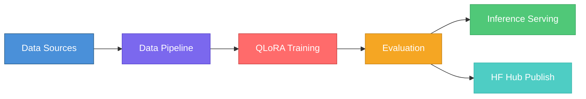
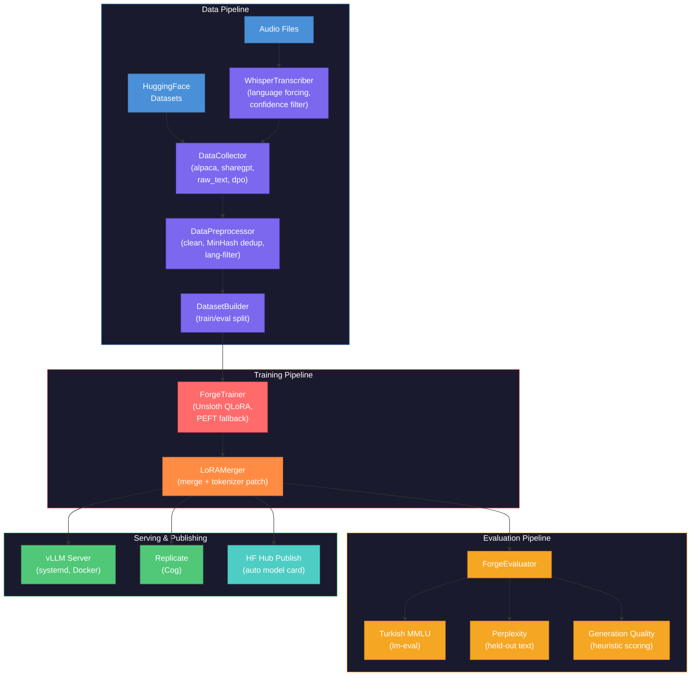
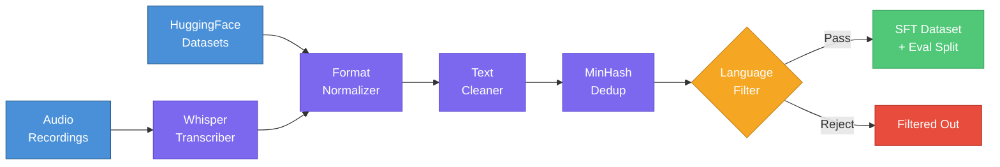
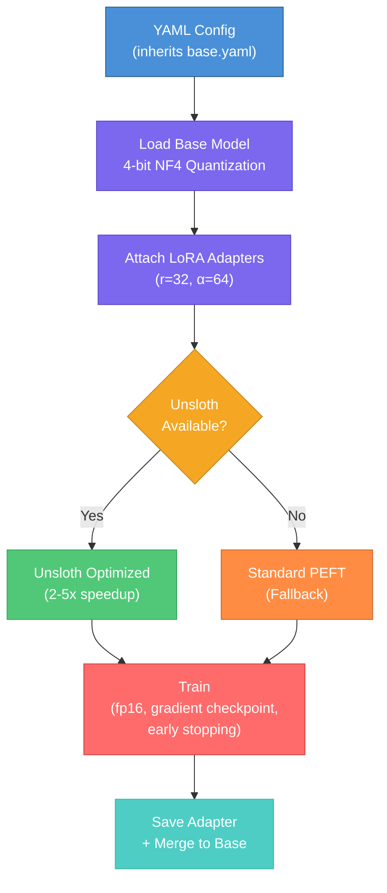
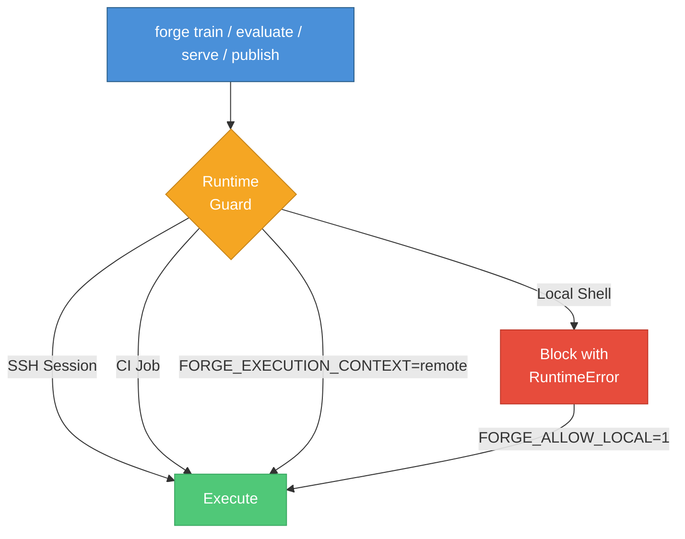
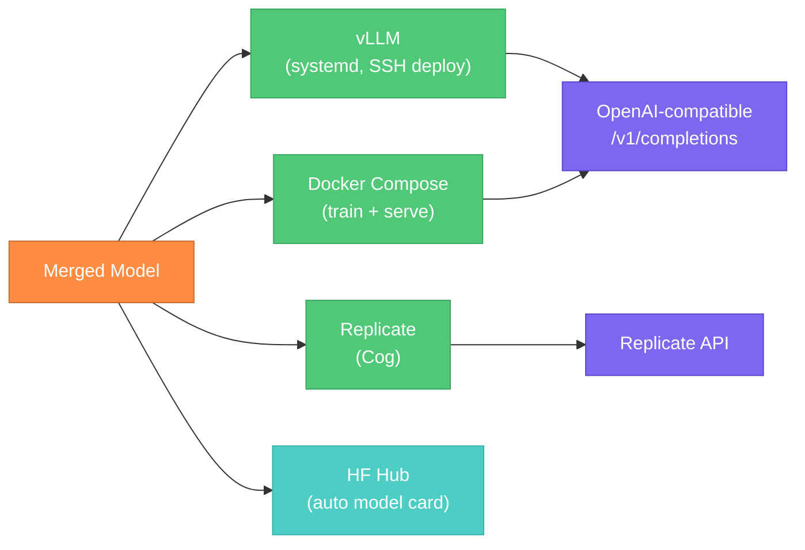
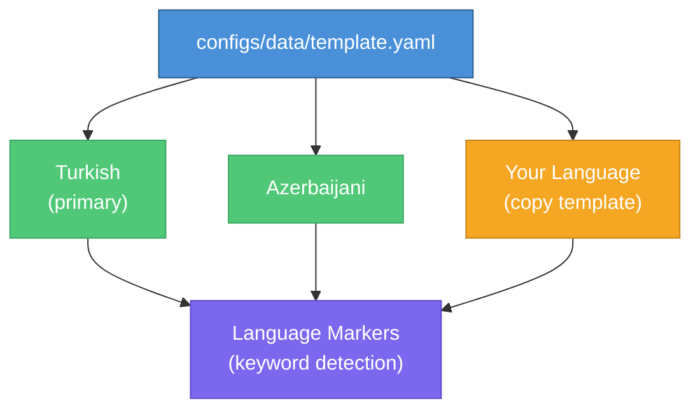

# LowResource-LLM-Forge

**Sovereign fine-tuning pipeline that takes low-resource languages from raw data to production inference — data collection, audio transcription, QLoRA training, evaluation, and serving — with V100-first GPU optimization and multi-language support out of the box.**

[](https://github.com/ogulcanaydogan/LowResource-LLM-Forge/actions/workflows/ci.yml)
[](https://python.org)
[](LICENSE)
[](https://github.com/unslothai/unsloth)
[](https://github.com/vllm-project/vllm)
[]()
[]()

---

## Why This Exists

Large language models perform well on high-resource languages (English, Chinese, German) but degrade significantly on low-resource languages — Turkish, Azerbaijani, Swahili, Kurdish — where pretraining data is scarce and evaluation benchmarks don't exist. Existing fine-tuning tools assume English data, unlimited GPU budgets, and established evaluation infrastructure.

This creates a structural barrier:

- **No training pipelines** designed for languages with fragmented, low-quality datasets scattered across HuggingFace, audio archives, and scraped corpora.
- **No hardware-aware optimization** for teams working with V100s instead of A100/H100 clusters — most QLoRA tools default to bf16, which V100s don't support.
- **No evaluation methodology** for languages without standardized benchmarks — you can't measure what you can't test.
- **No end-to-end path** from raw multilingual data to a deployed, benchmarked, published model that others can use.

LowResource-LLM-Forge solves this by providing a **single pipeline** that handles the entire lifecycle: collect and clean multilingual data, transcribe audio, fine-tune with V100-optimized QLoRA, evaluate with language-specific benchmarks, serve via vLLM, and publish to HuggingFace Hub — all from one CLI.

The project targets NLP researchers, language preservation teams, and engineering groups building sovereign AI capabilities for underserved language communities.

---

## How It Works



Upload datasets or audio in any supported language — the pipeline normalizes formats, removes duplicates, filters by language, trains a QLoRA adapter on V100-compatible settings, evaluates against configurable benchmarks, and deploys the merged model for inference.

---

## Architecture



---

## Key Capabilities

### Multi-Format Data Pipeline



| Feature | Description |
|---------|-------------|
| **Format normalization** | Alpaca, ShareGPT, raw text, DPO — all converted to unified SFT format |
| **Whisper transcription** | Audio-to-text with language forcing and log-probability confidence filtering |
| **MinHash deduplication** | Near-duplicate removal across large corpora |
| **Language detection** | Keyword-overlap heuristic for Turkic languages (Turkish, Azerbaijani) with extensible marker sets |
| **Quality filtering** | Minimum length enforcement, character validation, configurable thresholds |

### V100-Optimized QLoRA Training



| Constraint | Design Decision |
|-----------|-----------------|
| **fp16 only** | V100 (Volta) does not support bf16 — all configs enforce `fp16: true, bf16: false` |
| **4-bit QLoRA** | NF4 quantization enables 7B-9B models on 16-32GB VRAM |
| **Gradient checkpointing** | Trades compute for memory — critical for 9B models on 32GB V100 |
| **Unsloth fast path** | 2-5x training speedup when available, transparent PEFT fallback when not |
| **Early stopping** | `EarlyStoppingOnPlateau` with configurable patience and min-delta |
| **Config inheritance** | `base.yaml` → model-specific YAML via `_base` key, deep merge semantics |

### Evaluation Framework

| Benchmark | Method | Pass Threshold | Scope |
|-----------|--------|---------------|-------|
| **Turkish MMLU** | lm-evaluation-harness (`turkishmmlu` task) | ≥0.40 accuracy | Broad academic knowledge |
| **Perplexity** | Cross-entropy on held-out eval set | <50.0 | Language modeling quality |
| **Generation Quality** | Heuristic scoring on 10 diverse Turkish prompts | ≥3.5/5.0 | Fluency, coherence, character usage |

### Remote-First Execution Safety



Model-loading commands are blocked on local development machines by default. Only SSH sessions, CI jobs, and explicitly marked remote contexts are allowed — preventing accidental multi-hour GPU processes on laptops.

### Deployment Options



| Target | Method | Features |
|--------|--------|----------|
| **vLLM** | SSH + user-level systemd | Versioned model dirs, atomic symlink switching, API key enforcement, DGX Spark eager mode |
| **Docker** | `docker compose` | Training + serving containers, GPU passthrough |
| **Replicate** | Cog build + push | Managed inference API |
| **HuggingFace Hub** | Auto model card generation | Training config, eval results, usage examples embedded in card |

---

## Multi-Language Support



| Language | Config | Datasets | Status |
|----------|--------|----------|--------|
| **Turkish** | `configs/data/turkish.yaml` | Turkce-Instruct-Merged, turkish-text-data | Primary |
| **Azerbaijani** | `configs/data/azerbaijani.yaml` | AzInstruct_merged | Configured |
| **New language** | Copy `configs/data/template.yaml` | Bring your own datasets | Template ready |

Adding a new language requires:
1. A data config YAML with HuggingFace dataset sources
2. Optionally, language marker words in `preprocessor.py` for detection filtering
3. A model config inheriting from `configs/base.yaml`

---

## Supported Models

| Model | Base Architecture | V100 Compatible | Config |
|-------|-------------------|-----------------|--------|
| **Turkcell-LLM-7b-v1** | Mistral | Yes (primary target) | `configs/models/turkcell_7b.yaml` |
| **wiroai-turkish-llm-9b** | Gemma | Yes (tight on 32GB) | `configs/models/wiroai_9b.yaml` |
| **cere-llama-3-8b-tr** | Llama 3 | Yes | `configs/models/llama3_8b_tr.yaml` |

---

## Quick Start

```bash
# 1. Install
uv sync --extra dev

# 2. Download and preprocess Turkish data
forge download --config configs/data/turkish.yaml

# 3. Fine-tune on remote GPU host (SSH session)
forge train --config configs/models/turkcell_7b.yaml

# 4. Merge adapters into base model
forge merge --base-model TURKCELL/Turkcell-LLM-7b-v1 \
    --adapter artifacts/training/turkcell-7b-sft-v1/final \
    --output artifacts/merged/turkcell-7b-turkish-v1

# 5. Evaluate
forge evaluate --model artifacts/merged/turkcell-7b-turkish-v1

# 6. Publish to HuggingFace Hub
forge publish --model-dir artifacts/merged/turkcell-7b-turkish-v1 \
    --hub-repo ogulcanaydogan/turkcell-7b-turkish-sft \
    --training-config configs/models/turkcell_7b.yaml
```

## CLI Reference

All pipeline stages are accessible via the `forge` CLI:

| Command | Purpose |
|---------|---------|
| `forge download --config ...` | Download and preprocess training data |
| `forge transcribe --audio-dir ...` | Transcribe audio files via Whisper |
| `forge train --config ...` | Run QLoRA fine-tuning |
| `forge evaluate --model ...` | Run evaluation benchmarks |
| `forge merge --base-model ... --adapter ... --output ...` | Merge LoRA adapters into base model |
| `forge serve --config ...` | Start vLLM inference server |
| `forge publish --model-dir ... --hub-repo ...` | Publish model to HuggingFace Hub |
| `forge benchmark --base-url ...` | Benchmark an OpenAI-compatible endpoint |

All commands support `--help` for full option documentation. Run `make help` to see all Makefile targets.

---

## Post-Completion Roadmap

After the current priority training run is completed, the next improvement work is tracked in:

- `docs/ROADMAP.md`

Roadmap phases:

1. Stability hardening (NaN guards, fail-fast, auto-resume)
2. Turkish data expansion and quality filtering
3. A100 training recipe optimization
4. Serving throughput and latency optimization
5. Evaluation depth and release governance

---

## Notebooks

Interactive Jupyter notebooks for exploration and analysis:

| Notebook | Purpose |
|----------|---------|
| `notebooks/01_data_exploration.ipynb` | Dataset statistics, language distribution, preprocessing quality, sample inspection |
| `notebooks/02_training_analysis.ipynb` | Loss curves, learning rate schedules, LoRA weight analysis, WandB integration |

---

## Development

```bash
uv sync --extra dev
make help          # Show all available targets
make qa            # Run all quality gates (lint + typecheck + test)
make test          # pytest
make lint          # ruff
make typecheck     # mypy
```

### Quality Gate Status

| Check | Tool | Status |
|-------|------|--------|
| Lint | ruff | 0 issues |
| Types | mypy (strict) | 0 issues in 25 source files |
| Tests | pytest | 78 passed |
| Coverage | pytest-cov | 47% (threshold: 40%) |

---

## Hardware Requirements

| Stage | Minimum | Recommended |
|-------|---------|-------------|
| Training (7B QLoRA) | V100 16GB | V100 32GB |
| Training (9B QLoRA) | V100 32GB | A100 40GB |
| Inference | 16GB VRAM | DGX Spark (GB10) |
| Data Pipeline | CPU only | 16GB RAM |
| Audio Transcription | CPU (slow) | GPU with 8GB VRAM |

---

## License

Apache-2.0
